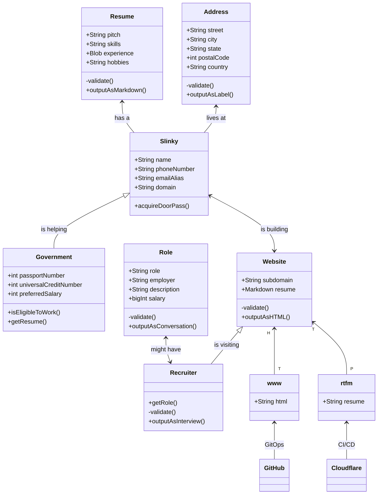
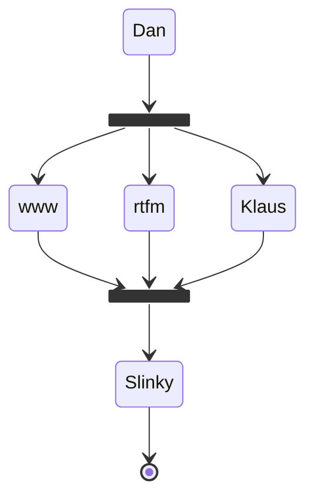

# :simple-spring_creators: Dan Slinky

Welcome to my corner of the <mark>World Wide Web</mark>. Among the vast digital landscape, this website stands as my personal mySpace - a blend of professionalism and personality. Inspired by Mary Poppins' philosophy, I believe in infusing every task with a touch of enjoyment, turning work into a delightful adventure.

I'm known as <mark><large>Slinky</large></mark>, a mix of <mark style=color:white;background-color:black><small>Eeyore</small></mark>  and a dash of <mark style=color:purple;background-color:transparent>T̨͈͗̌ͥḣ̖̻͛̓ā̤̓̍͘ṇ̤͛̒̍o̯̱̊͊͢s̠҉͍͊ͅ''</mark> snap. While my hardware may be considered legacy, it's ripe for upgrades to meet evolving demands. Whether navigating the digital realm on my trusty iPad Pro or exploring the possibilities of [Asahi Fedora](https://asahilinux.org/) on my MacBook Pro, I embrace technology with gusto.

One of my cherished reads is [jPod](), reflecting my eclectic taste. Join me on my journey via [GitHub](https://github.com/danslinky){ data-preview }, where I document my job hunt under [@danslinky](https://github.com/danslinky)'s Job Hunt. Feel free to engage, comment, or spark discussions - it's all about the collective journey forward.

## Current Project Diagram

The active project currently looks something like this:



## Friends

 1. [Tom](https://en.wikipedia.org/wiki/Tom_Anderson)
 


<h2>𝒲𝒶𝓇𝓂 𝑅𝑒𝑔𝒶𝓇𝒹𝓈</h2>
<h1>𝒦𝓁𝒶𝓊𝓈 𝐻𝑒𝓇𝑔𝑒𝓇𝓈𝒽𝑒𝒾𝓂𝑒𝓇</h1>
<h1>Ḱłᾄὗṩ Ἤἔʀʛἔʀṩђἔἷмἔʀ</h1>
<h1>K͟l͟a͟u͟s͟ H͟e͟r͟g͟e͟r͟s͟h͟e͟i͟m͟e͟r͟</h1>

<iframe width="560" height="315" src="https://www.youtube.com/embed/TcGUq53OXJc?si=-HF_EE1vSyAPNgv7&amp;clip=UgkxXDTG-KsrnbG0r2rfElML2bWChXObOOb-&amp;clipt=ENjxFhjb9Rc" title="YouTube video player" frameborder="0" allow="accelerometer; autoplay; clipboard-write; encrypted-media; gyroscope; picture-in-picture; web-share" allowfullscreen></iframe>

## Jokes

```sh
dig +short txt udp-joke.danslinky.co.uk
```

PRs welcome.