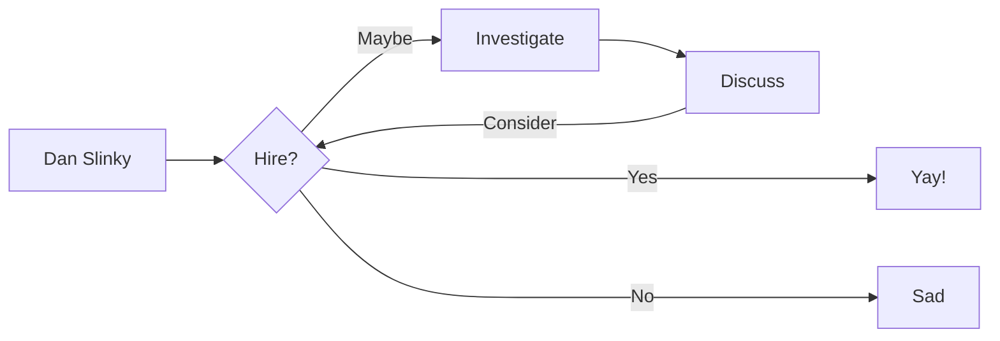

# Resume as a Service (RaaS)

!!! note "#opentowork"

    I'm actively seeking a new <large><b>remote</b></large> or <small>hybrid</small> role, with the possibility of relocation if the opportunity offers breathtaking mountain views and a stellar canteen. I'm currently rooted in the ~~EU~~:flag_gb::fire:, where my [home office](https://github.com/danslinky/danslinky.co.uk/issues/2) exudes professionalism, contrasting with the casual flair of my [social media](/about) presence.

Welcome to my RaaS! <small>~~RAaS~~ ~~rAAS~~ ~~rAPI~~</small> :eyes:

<div class="grid cards" markdown>
- Demonstrating :fontawesome-brands-html5: __HTML__ with a structured Resume
- Abusing :fontawesome-brands-js: __JavaScript__ with an interactive Resume
- Showcasing :fontawesome-brands-css3: __CSS__ with a pretty Resume
- Celebrating :fontawesome-brands-internet-explorer: __Internet Explorer__ ... huh?
</div>

## Quickstart



<div class="grid cards" markdown>

-   :material-clock-fast:{ .lg .middle } __Enterprise SLA__

    ---

    Download the Resume of an experienced, hard-working, and skilled Platform Engineer, SRE, DevOps and Linux sysadmin

    [:octicons-arrow-right-24: Getting started](#)

-   :fontawesome-brands-markdown:{ .lg .middle } Download my Resume in __Markdown__

    ---

    See how I have ~~focussed~~ on __content__ and can generate a responsive and searchable `static` documentation site

    [:octicons-arrow-right-24: Download](/resumes/markdown)

-   :material-format-font:{ .lg .middle } __Made to measure__

    ---

    Download my Resume in [`.json`](json.md), [LaTeX](resume.pdf), [Word](resume.docx) or [`yaml:`](yaml.md), and use my [CLI](#command-line-interface)

    [:octicons-arrow-right-24: curl $danslinky | sh](#)

-   :material-scale-balance:{ .lg .middle } __Open Source__

    ---

    You can contribute to `mkResume` on [GitHub](https://github.com/danslinky) or
    meet me at [FOSDEM](https://fosdem.org/)

    [:octicons-arrow-right-24: SORRY THE ROOM IS FULL](#)

</div>

You can also view my Resume in [HTML](https://rtfm.danslinky.co.uk/resumes/markdown):eyes: or [open a GitHub issue](https://github.com/danslinky/danslinky.co.uk/issues/new/choose) where you can also read and give [testimonials](#testimonials) and [endorsements](#testimonials).

## Command Line Interface

You can install `slinkctl`, my Resume CLI:

```sh
curl -sSL https://resume.danslinky.co.uk/resume.sh | sh
man slinkctl 
slinkctl rtfm
```

## Authentication

RaaS does not require you to authenticate. If you do need to add Social and Enterprise authentication to your app, try [Auth0](/rtfm/security/sso.html).<small>admin / new password`******`5</small>

## Customer Feedback

[Letters of Recommendation](https://github.com/danslinky/danslinky.co.uk/issues/new/choose) and [Endorsements](https://linkedin.com/in/danslinky) for Dan Slinky can be managed using GitHub or LinkedIn.

<blockquote>
Dan is one of the best platform engineers I've worked with. He has a vast knowledge of AWS, Kubernetes, Terraform and similar platform technologies. I learned a lot while working together. He is capable of taking a vague requirement and converting it into working infrastructure. He puts thought into the maintainability, scalability and observability of his solutions and writes good accompanying documentation. Dan is also a good mentor helping other in the team and even outside of his team upskill and learn from him.
<cite>
<a href="https://www.linkedin.com/in/robertmarsal/" target="_blank">Robert Marsal, Enterprise Architect at Adarga</a>
</cite>
</blockquote>

## Release Notes

It's a work in prod-gres.
