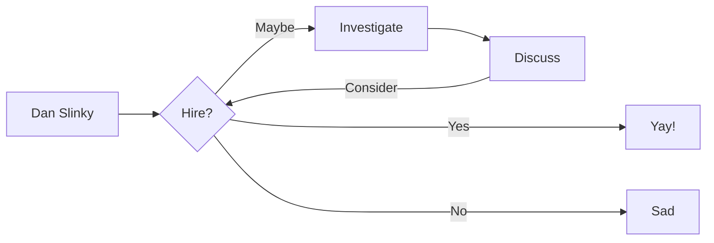

# Resume as a Service (RaaS)

Hello, and welcome to my RaaS, you may! <small>~~RAaS~~ ~~rAAS~~ ~~rAPI~~</small> :eyes: How the devil are you? Have you had a good day? My name's Dan and I'm watching :material-youtube: [You](https://www.youtube.com/@AutoShenanigans)....

The RaaS allows you, a potential technical recruiter, hiring manager or fellow Platform comrade, to download my Resume.

## Features

-   :fontawesome-brands-markdown:{ .lg .middle } Passion for __Markdown__

    ---

    See how I have ~~focussed~~ on __content__ and can generate a responsive and searchable `static` documentation site.

    [:octicons-arrow-right-24: Read my Resume](/resumes/markdown) 

-   :material-format-font:{ .lg .middle } __Made to measure__

    ---

    Download my Resume in 
    
    - :material-code-json:__[`.json`](json.md)__
    - :simple-latex:__[LaTeX](/resumes/latex)__
    - :material-file-word:__[Word](resume.docx)__ _(deprecated)_
    - :simple-yaml:__[`yaml:`](yaml.md)__

-   :material-clock-fast:{ .lg .middle } __Enterprise SLA__

    ---

    Download the Resume of an experienced, hard-working, and skilled Platform Engineer, SRE, DevOps and Linux sysadmin.

    [:octicons-arrow-right-24: Getting started](/resumes/markdown)

-   :material-scale-balance:{ .lg .middle } __Open Source__

    ---

    You can contribute to `mkResume` on [GitHub](https://github.com/danslinky) or
    meet me at [FOSDEM](https://fosdem.org/)

    [:octicons-arrow-right-24: SORRY THE ROOM IS FULL](#)

You can also view my Resume in [HTML](https://rtfm.danslinky.co.uk/resumes/markdown):eyes: or [open a GitHub issue](https://github.com/danslinky/danslinky.co.uk/issues/new/choose) where you can also read and give [testimonials](/resumes/markdown#endorsements) and [endorsements](/resumes/markdown#endorsements).
