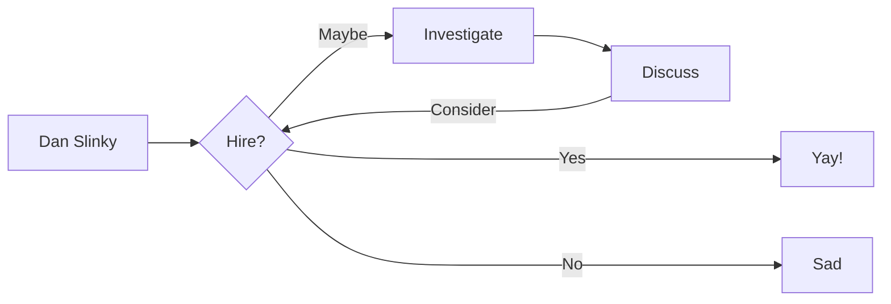

# Resume as a Service (RaaS)

Hello, and welcome to my RaaS, you may! <small>~~RAaS~~ ~~rAAS~~ ~~rAPI~~</small> :eyes: How the devil are you? Have you had a good day? My name's Dan and I'm watching You....



The RaaS allows you, a potential technical recruiter, hiring manager or fellow Platform comrade, to export and download my Resume. It's so good, you're already exporting and download it just by reading this paragraph of text.

This Software as a Service Cloud Native platform is:

<div class="grid cards" markdown>
- Demonstrating :fontawesome-brands-html5: __HTML__ with a structured Resume
- Abusing :fontawesome-brands-js: __JavaScript__ with an interactive Resume
- Showcasing :fontawesome-brands-css3: __CSS__ with a pretty Resume
- Celebrating :fontawesome-brands-internet-explorer: __Internet Explorer__ ... huh?
</div>

## Features

<div class="grid cards" markdown>

-   :material-clock-fast:{ .lg .middle } __Enterprise SLA__

    ---

    Download the Resume of an experienced, hard-working, and skilled Platform Engineer, SRE, DevOps and Linux sysadmin.

    [:octicons-arrow-right-24: Getting started](#)

-   :fontawesome-brands-markdown:{ .lg .middle } Download my Resume in __Markdown__

    ---

    See how I have ~~focussed~~ on __content__ and can generate a responsive and searchable `static` documentation site.

    [:octicons-arrow-right-24: Download](/resumes/markdown)

-   :material-format-font:{ .lg .middle } __Made to measure__

    ---

    Download my Resume in [`.json`](json.md), [LaTeX](resume.pdf), [Word](resume.docx) or [`yaml:`](yaml.md), or use my [CLI](#command-line-interface) release candidate.

    [:octicons-arrow-right-24: curl $danslinky | sh](#)

-   :material-scale-balance:{ .lg .middle } __Open Source__

    ---

    You can contribute to `mkResume` on [GitHub](https://github.com/danslinky) or
    meet me at [FOSDEM](https://fosdem.org/)

    [:octicons-arrow-right-24: SORRY THE ROOM IS FULL](#)

</div>

You can also view my Resume in [HTML](https://rtfm.danslinky.co.uk/resumes/markdown):eyes: or [open a GitHub issue](https://github.com/danslinky/danslinky.co.uk/issues/new/choose) where you can also read and give [testimonials](#testimonials) and [endorsements](#testimonials).

## Command Line Interface

You can install `slinkctl`, my Resume CLI using `curl` or `nc`.

```sh
curl -sSL https://resume.danslinky.co.uk/resume.sh | sh
man slinkctl 
slinkctl rtfm
```

## Authentication

RaaS does not require you to authenticate. If you do need to add Social and Enterprise authentication to your app, try [Auth0](/rtfm/security/sso.html).<small>admin / new password`******`5</small>

## Release Notes

It's a work in prod-gres.
