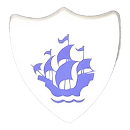

# :simple-markdown: Dan Slinky { align=right }

[__www__](https://rtfm.danslinky.co.uk/resumes)  [:material-linkedin:](https://linkedin.com/in/danslinky "Visit Dan Slinky's LinkedIn profile")  [:simple-github:](https://github.com/danslinky "Visit Dan Slinky's GitHub profile")  [:material-email:](mailto:sysadmin@danslinky.co.uk "Email Dan Slinky")

## :fontawesome-solid-terminal: Introduction

- Technical experience and leadership on diverse projects in __Platform Engineering__, __SRE__, and __DevSecOps__ roles, focussing on container orchestration and seamless integration.
- Proficient in :material-docker: __Docker__, :material-dharmachakra: __Kubernetes__, and the wider :simple-cncf: Cloud Native ecosystem, with expertise in __GitOps__, __CI/CD__, and __Infrastructure as Code (IaC)__ on __AWS__, __GCP__, and __Azure__.

I’m an experienced Engineer, adept at designing, developing, and maintaining diverse projects, specialising in platform optimisation, ensuring security, and integrating self-service. I can collaborate effectively across multidisciplinary
teams, tackling technical challenges and enhancing organizational processes. I’m committed to delivering functional,
maintainable, scalable, and observable solutions, and I’m passionate about driving innovation, fostering continuous
learning, and promoting team growth.

## :material-briefcase: Career

### :material-office-building: Hergersheimer GmbH

#### 2024 Freelance sysadmin

- Focussing on :simple-asahilinux: __Linux__ health information systems management and document retrieval, platform documentation, and __Lua__ scripting. I'm responsible for the deployments of __OPNSense__, __XCP-ng__, self-hosted __Infisical__ and __Cloudflare__.

### :material-office-building: Adarga

#### 2022/23 Lead Platform Engineer

- As a technical leader in the Platform Engineering and SecOps team, I oversaw operations for a multi-tenanted AI SaaS platform for Enterprise and Defense customers utilizing __Terragrunt__, :material-terraform: __Terraform__,  on :fontawesome-brands-aws: , and other platforms.

- Promoted robust security and secrets management, aligning with stringent customer requirements and integrating SecOps practices into deployment pipelines. Utilized __CI/CD__ tools such as :simple-github: __GitHub Actions__, :simple-circleci: __CircleCI__, and :simple-argo: __ArgoCD__ to facilitate efficient and reliable deployments while ensuring compliance with security standards and protocols.

- Spearheaded a significant AWS cost reduction initiative, championing __FinOps__ practices and optimizing cloud cost reporting using tools like [opencost.io](https://www.opencost.io/ "OpenCost.io"), kubecost, __Prometheus__, and SysDig. I implemented strategies to foster service ownership and identified areas for further optimisation, emphasising the importance of financial responsibility and efficiency within the organisation.

- Collaborated on OpenTracing/Telemetry implementation to enhance application observability and performance, particularly in environments utilizing :simple-apachekafka: __Kafka__ and Benthos for message routing.

- I expanded the platforms __SSO__ offering by implementing __SAML__, __Azure AD__ integration, supported by Auth0. I also assessed the technical feasibility of Plausible web analytics and contributed to implementations of Tigergraph and Neo4j.

<!-- - I also oversaw recruitment into the team, conducting interviews, promoting team planning, before transitioning responsibilities to a permanent Engineering Manager and recruitment team. -->

#### 2017/19 DevOps Engineer

- Instrumental in establishing the foundation of a __Kubernetes__ SaaS platform using a microservices architecture with Kafka, __Python__, Java, Node.js, and __React__ SPAs. Contributed __OAuth2__, __API__ management with __Kong__, __nginx__, and collaborated closely with engineering and _data science_ teams.

<!-- - Moreover, I managed onboarding processes utilizing Apple MDM, fleet DM, __osquery__, and Munki, overseeing app packaging and deployment, while also deploying and maintaining the Atlassian stack, including __Jira__, Confluence, and Bamboo. -->

### :material-office-building: Cookpad

#### 2021 Site Reliability Engineer

- Transitioned to the SRE team, assuming a broader global platform responsibility and collaborating closely with colleagues at Cookpad Japan. Embraced learning __Golang__ and leveraged the power of __Jsonnet__.

- Collaborated with SRE team members to enhance documentation, address on-call incidents, lead __Kubernetes__ migrations, and fulfill ad hoc support requests. Additionally, contributed to platform stability and automation by utilizing __Helm__ and __Ruby__ within our infrastructure.

#### 2020 Machine Learning Infrastructure Engineer

- Initially joined the __MLOps__ team on a short-term contract, concentrating on Kubernetes observability before transitioning to a permanent role. Focused on deploying __Elastic__ and __Prometheus__, __Thanos__ for extended metric storage, coupled with __Grafana__, __Loki__ to promote ownership of ML applications during deployment.

- Revamped Kubernetes application distribution and deployment methods by utilizing Kustomize and Flux CD. Also evaluated Kubeflow/Argo Pipelines for potential future investment, solidifying our commitment to enhancing ML application deployment processes and promotting machine learning capabilities in the organisation.

### :material-office-building: Systems Administrator, Torchbox, 2015-2016

- Supporting agency business and customer digital infrastructure including __Drupal__ and __Wagtail__ deployments.

- Led the relocation of the Bristol office, ensuring a seamless transition. Established a fully operational workspace by Monday morning through deployments of fibre optic, Ubiquiti unifi, VOIP, and MikroTik.

- Explored a __Kubernetes__ deployment alongside __Sensu__, __Consul__ and __Riemann__ to enhance the agency's infrastructure. I also demonstrated my resilience in June 2016, tackling challenges with determination and composure.

### :material-office-building:  Operations Engineer, Future, 2013-2015

- Managed global web properties utilizing CDNs, __nginx__, PHP, __RabbitMQ__, and __Puppet__ for infrastructure as code (IaC), with continuous deployment facilitated by `rmq://`.

- Led initiatives for data center and __Xen/XCP__ infrastructure consolidation and upgrade. Designed and implemented enhanced storage solutions, incorporating recommended LACP groupings and integrating an advanced storage array for improved reliability and performance.

### :material-train: Drupal DevOps Engineer, Eurostar, 2011-2013

- Lead __DevOps__ for the successful relaunch of eurostar.com, utilizing __Drupal__ and __ActiveMQ__, collaborating with SNCF. Implemented __CI/CD__ pipelines using __Jenkins__, __Puppet__, and __Capistrano__.

- Provided technical guidance, overseeing Global Load Balancing solutions and provided training for Mumbai teams, fostering global collaboration.

<!-- ### :material-office-building: DevOps Engineer, Capgemini, 2011-2013
- Rackspace, Royal Mail, Burberry, Michael Page, HMRC -->

### :material-office-building: Operations Engineer, Sift, 2009-2011: Drupal, CentOS, Xen, VMWare/ESXi

### :material-school: BA (Hons) Information Systems Analysis at UWE, Bristol, 2009
### :material-atom: Technical Student, CERN, Switzerland, 2007-2008
Linux, PXE, tftpboot, ia64, Perl, XML/RPC & Oracle

### :material-school: BTEC National Diploma IT Practitioner at Cornwall College, 2005
### :fontawesome-solid-network-wired: CISCO Certified Network Associate, CISCO Academy, 2004
## :material-gamepad: Hobbies include :pizza: , :material-bike: , and :simple-linux: 